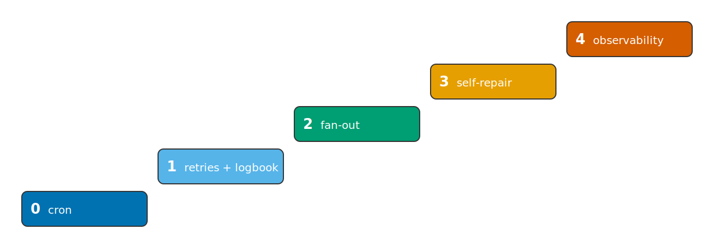
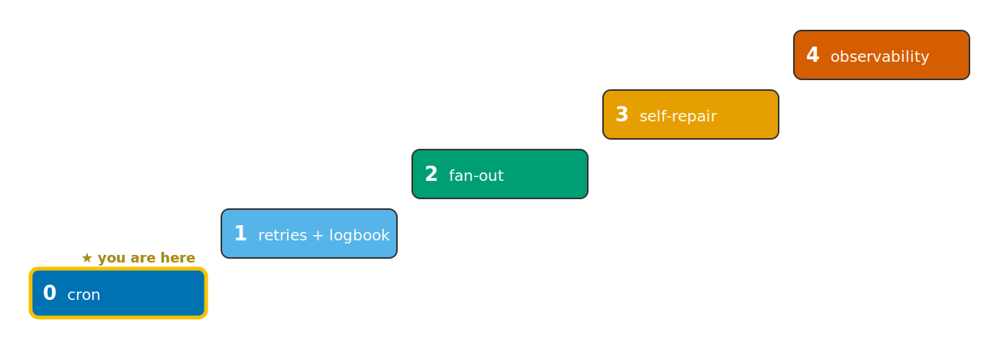
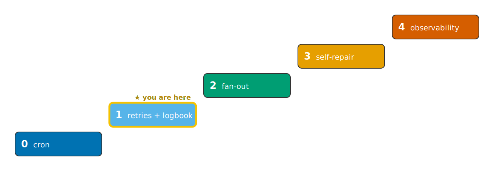
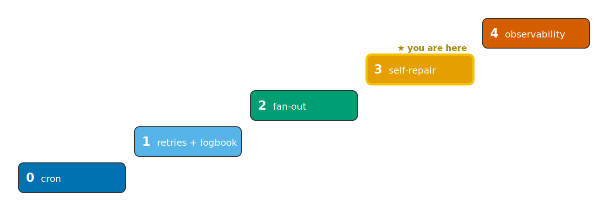
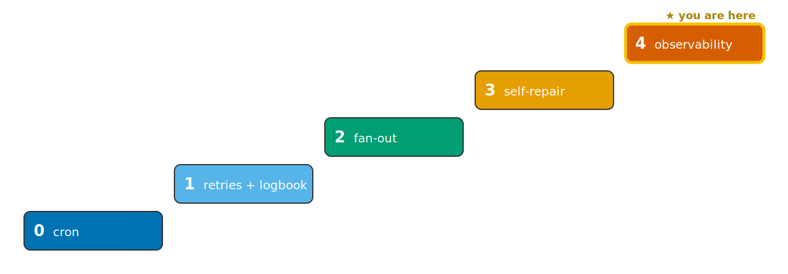
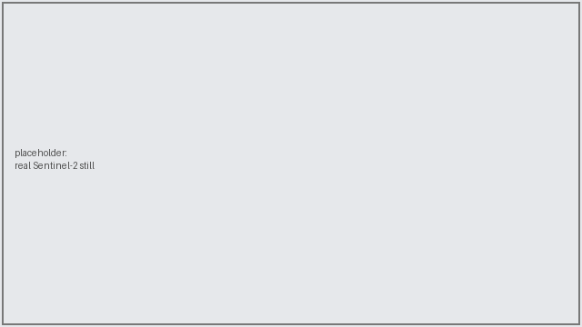
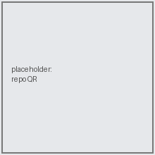

<!--
SCAFFOLD — structure + placeholders only. The narrative is yours to write; this lays out the spine
from claude_docs/SPEC.md (§The Talk) so the section order, the ladder diagram, and the screencast
slots are wired up. Render locally: `npx @marp-team/marp-cli docs/slides/talk.md -o talk.html`
(CI renders HTML + PDF — see .github/workflows/ci.yml). The color-blind-safe ladder lives in
ladder.svg; swap in the per-rung highlighted variant on each rung's slide.
-->

# From Cron Job to Self-Healing Pipeline

### The maturity ladder for Earth-observation ingestion

_Your name · FOSS4G Europe 2026_

<!-- Hook: the 3 a.m. pager. One slide, one feeling. -->

---

## The ladder

> Folder number == rung number. The unit of work never changes; only the orchestration grows.

---

## Rung 0 — the honestly-fragile cron job

<!-- TODO: the laptop crontab. "Nowhere to look at 3 a.m." -->

- `crontab` → `docker run` · no Kubernetes · no catalog
- _placeholder: screencast clip — rung 0 (optional)_

---

## Rung 1 — Argo retries + the logbook

<!-- TODO: same image, now retried; a STAC logbook you can look at. -->

- `FAIL_ONCE` → fail once → **retry** → succeed
- the item appears in the logbook (stac-browser)
- 📽 **clip: `rung1-retry`** (the retry, ~30 s)

---

## Rung 2 — fan-out backfill (politely)

- `withItems` + `parallelism` cap → measured **~6×** here
- 📽 **clip: `rung2-fanout`**

---

## Rung 3 — the logbook repairs itself  ⟵ the heart

- `find_gaps` → fan-out ingest over only the missing days → ⬜ becomes ✅
- 📽 **clip: `rung3-gapclose`**

---

## Rung 4 — make the self-correction visible

- a daily report: gap heatmap + retry summary (Argo API, no Prometheus)
- 📽 **clip: `rung4-report`**

---

## Two levels of self-correction

| Level | Failure | Who fixes it |
|-------|---------|--------------|
| Item | a run fails transiently | Argo retries (rung 1) |
| System | a whole day is missing | the logbook refills it (rung 3) |

<!-- TODO: the one-sentence takeaway. -->

---

## Why Argo (and not …)?

<!-- TODO: the positioning slot — pre-empt the Q&A opener. Airflow / Prefect / plain CronJobs. -->

---

## …and here it is on real Sentinel-2

<!-- 20-second real-data moment: `make demo-real` → a real S2 item in the same catalog. -->

- same frozen ingest, `SOURCE_TYPE=earthsearch` · _contains modified Copernicus Sentinel data_

---

## Where the ladder leads — `PROFILE=prod`

<!-- TODO: eoAPI / titiler / Grafana, the same workflows unchanged. -->

---

## Recap — find your rung, climb one

**Clone & run:** _repo URL_  ·  QR ↓

