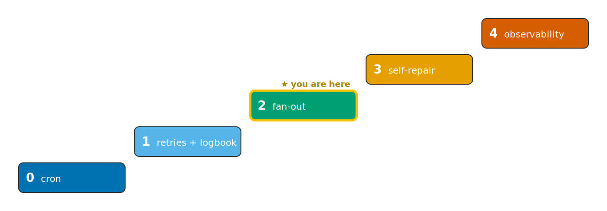

# Stage 02 — Fan-out backfill (Rung 2): go fast, but politely

> Same image, same env-driven config. The only new idea is *shape*: ingest many days **at once**
> instead of one at a time — with a cap so "fast" never means "rude."



Rung 1 ingested one day. Backfilling a month that way is 30 sequential runs. Rung 2 keeps the exact
same `ingest` and fans it out across the window with Argo's `withItems`, while a **`parallelism`
cap** bounds how many run concurrently.

```
ensure-collection ─▶ backfill ─┬─▶ ingest --day 2026-03-01 ┐
   (once)                      ├─▶ ingest --day 2026-03-02 ┤  at most `parallelism: 10`
                               ├─▶ ingest --day 2026-03-03 ┤  pods in flight at a time
                               │           …                │
                               └─▶ ingest --day 2026-03-30 ┘
```

## Run it

```bash
make up                 # if not already running
make demo STAGE=02      # backfill 30 days; watch ~10 ingest pods run at a time
make browse             # the whole month appears in the logbook at once
```

`INGEST_SLEEP=2` is set on each ingest to stand in for real per-item IO cost, so the parallel
collapse is visible on the wall clock. No `FAIL_ONCE` here — rung 2 is about throughput, not
retries.

## The measured speedup (the point of the rung)

The sequential baseline is the **same workflow with `parallelism: 1`** — no separate manifest to
drift:

```bash
sed 's/parallelism: 10/parallelism: 1/' stages/02-fanout/workflows/backfill.yaml \
  | argo submit -n eo --wait -                 # sequential baseline
argo submit -n eo --wait stages/02-fanout/workflows/backfill.yaml   # fan-out
```

| Run | `parallelism` | 30 items × `INGEST_SLEEP=2s` | wall-clock |
|-----|---------------|------------------------------|-----------|
| Sequential | 1 | one at a time | **311 s** |
| Fan-out | 10 | ≤10 at a time | **50 s** |
| | | | **≈ 6.2× faster** |

Measured 2026-06-10 on a single-node `kind` cluster (Apple M5, 10-core / 32 GB, warm image cache).
The catalog goes from empty to **30 items** (`MOI-AV_20260301 … MOI-AV_20260330`) in one go.

### Why 6.2× and not 10× (cap = 10)?

Honest answer: **per-pod startup overhead, on one node.** Each ingest is `~2 s` of simulated work
plus a few seconds of pod scheduling/pull/init — and a single kind node can't truly bring up 10
pods' worth of startup in parallel. So the *effective* parallelism is below the cap, and the ideal
`10×` erodes to a measured `~6×`. That's the real lesson: **the cap is a politeness ceiling, not a
throughput guarantee** — it protects the upstream source (and your one node), and the speedup you
actually get is whatever the slowest shared resource allows. Bigger per-item cost (real IO) pushes
the ratio back toward the cap.

## What did *not* change

`src/eo_ingest/` is untouched — no fan-out code, no batching logic in the unit of work. The
parallelism lives entirely in the Argo spec (`withItems` + `parallelism`). `ingest.py` is still
byte-identical to its rung-1 form (AD-2).

## The 2 → 3 delta (next rung)

Rung 2 backfills a window you name by hand. Rung 3 (`stages/03-stac-logbook/`) asks the **logbook**
which days are actually *missing* (`find_gaps`) and fans out over only those — the catalog starts
driving its own repair.
